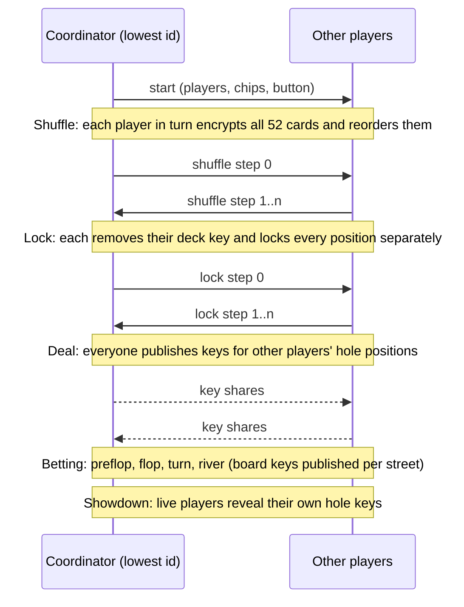

<div align="center">


# p2p-mind-poker

**Trustless Texas Hold'em, peer to peer. No server, no dealer, no one to trust.**

A community-built, **unofficial** [Logos Basecamp](https://logos.co) module that deals poker over
`logos-delivery` using *mental poker* cryptography, so that every player's hole
cards stay secret and nobody controls the shuffle.


</div>

> [!WARNING]
> **Unofficial, experimental software, play money only.** This is not an
> official Logos module and is not affiliated with, endorsed by or supported by
> Logos, IFT or any of their projects. It is an unaudited demo with no warranty
> of any kind, and the authors accept no responsibility for anything that
> results from using it. See the [Disclaimer](#disclaimer).

---

## Contents

- [Features](#features)
- [How it works](#how-it-works)
- [Quick start](#quick-start)
- [Build from source](#build-from-source)
- [Play across computers](#play-across-computers)
- [Run two peers on one machine](#run-two-peers-on-one-machine)
- [Testing](#testing)
- [Status & limitations](#status--limitations)
- [Lessons learned](#lessons-learned)
- [Disclaimer](#disclaimer)
- [Licence](#licence)

## Features

- 🃏 **No trusted dealer.** Every player takes part in the shuffle, so no single
  party can see the order or rig the deal.
- 🔒 **Private hole cards over a public channel.** Everything is broadcast, but
  only you hold the last key to your own two cards.
- 🌐 **Fully peer to peer.** Messages travel over `logos-delivery` (Waku relay).
  There is no game server.
- ⚖️ **Deterministic game engine.** Every peer runs the same betting and
  showdown logic, so everyone agrees on the pot, the turn order and the winner.
- 🧪 **Offline test harness.** The cryptography and betting engine are tested
  without Basecamp or a network.

## How it works

`delivery_module` is **broadcast** pub/sub: every peer receives every byte
published on a content topic. That's fatal for poker, where your hole cards must
stay private and no one may rig the shuffle.

The fix is **mental poker** (Shamir, Rivest and Adleman, 1979). It relies on a
*commutative* cipher, `c = mᵉ mod p`, where encryptions can be applied and
removed in any order: `(mᵃ)ᵇ ≡ (mᵇ)ᵃ`. Several players can each lock the deck,
and later peel their locks off independently.

`p` is the 2048-bit safe prime from RFC 3526 (MODP Group 14). Cards are encoded
as quadratic residues, so a ciphertext's Legendre symbol leaks nothing.



All messages are JSON on `/p2p-poker/1/table/json`, tagged with a `type` and a
per-message id for de-duplication. Seats are ordered by peer id. The lowest id
is the **coordinator**, which only decides when a hand starts and has **no**
cryptographic privilege.

| Step | What happens |
|---|---|
| **1. Join** | Peers announce `{type:"join"}` and sit down with 1000 play-money chips. Joins are re-sent every 5 s; `{type:"leave"}` gives the seat up. |
| **2. Start** | The coordinator broadcasts the players, chip counts and dealer button. Everyone generates fresh keys. |
| **3. Shuffle** | Each player in turn encrypts all 52 cards with a whole-deck key and shuffles. Afterwards nobody knows the order. |
| **4. Lock** | Each player removes their whole-deck key and re-encrypts every *position* with its own per-card key. |
| **5. Deal** | Positions `2k, 2k+1` belong to seat *k*. Every other player publishes their key for those positions. Only seat *k* holds the final key. |
| **6. Betting** | Preflop, flop, turn and river, with fold, check, call and raise. Board cards are revealed by everyone publishing their keys for those positions. |
| **7. Showdown** | Live players publish their own hole keys. Everyone decrypts the hands, runs the 5-of-7 evaluator and awards the pot. |

## Quick start

**Download:** grab `logos-poker-module-lib.lgx` and `logos-poker_ui-module.lgx`
from the [latest release](https://github.com/hackyguru/p2p-mind-poker/releases/latest).
Each one holds both macOS (Apple Silicon) and Linux (x86_64) builds. In
Basecamp, open **Modules → Install LGX Package** and install the core first,
then the UI.

**Build it yourself:** needs [Nix](https://nixos.org) with flakes, and Logos
Basecamp 0.2.3. `install.sh` targets an Apple Silicon Mac.

```bash
git clone https://github.com/hackyguru/p2p-mind-poker.git
cd p2p-mind-poker

(cd poker-core && nix build '.#lgx-portable' --out-link result-portable)
(cd poker-ui   && nix build --override-input poker path:../poker-core '.#lgx-portable' --out-link result-portable)

./install.sh    # quits Basecamp, installs both modules
```

Then [start two peers](#run-two-peers-on-one-machine) and deal a hand.

## Build from source

```
p2p-mind-poker/
├── poker-core/                  # C++ Qt plugin "poker"
│   ├── src/
│   │   ├── poker_interface.h    # Q_INVOKABLE API surface
│   │   ├── poker_crypto.{h,cpp} # SRA commutative cipher (OpenSSL BIGNUM)
│   │   ├── poker_game.{h,cpp}   # betting state machine + 5-of-7 evaluator
│   │   └── poker_plugin.{h,cpp} # delivery wiring + protocol orchestration
│   └── test/run.sh              # offline harness
├── poker-ui/                    # QML table view (depends on poker-core)
│   └── Main.qml
└── install.sh                   # build output -> local Basecamp
```

```bash
# Core (the first build is long: delivery_module's Nim closure + OpenSSL)
cd poker-core
nix build '.#lgx-portable' --out-link result-portable

# UI. Its `poker` input points at this repo's poker-core on GitHub;
# override it to build against your local checkout.
cd ../poker-ui
nix build --override-input poker path:../poker-core '.#lgx-portable' --out-link result-portable
```

Install both `result-portable/*.lgx` files from Basecamp's **Modules → Install
LGX Package** (core first, then UI), or run `./install.sh`. The script handles
three steps that are easy to miss by hand:

- **It quits Basecamp first.** A module dylib can't be replaced while it's loaded.
- **It re-signs each core dylib** (`rm`, `cp`, then `codesign --force --sign -`).
  Overwriting in place keeps a stale code-signing hash, and Basecamp gets
  `SIGKILL (Code Signature Invalid)` on the next launch.
- **It copies the package's `assets/` directory.** Without it the sidebar icon
  falls back to a two-letter text tile.

## Play across computers

Install the modules on each computer and open Basecamp normally. Every node
starts with a fresh random identity and connects to the Logos `logos.dev` fleet
(cluster 3), which relays the table's messages between players. Nothing else
needs configuring.

> [!IMPORTANT]
> **Use v0.2.1 or newer on every computer.** Earlier builds can't play across
> machines: every node used the same built-in key, and Basecamp 0.2.3's
> delivery module still puts the `logos.dev` preset on cluster 2, which the
> fleet (now on cluster 3) disconnects. The module now configures cluster 3
> itself. Set `POKER_PRESET=<name>` to use a stock preset instead.

## Run two peers on one machine

Poker needs at least two players. Two instances on one Mac clash on their P2P
ports, and each would have to find the other through the fleet.
`POKER_INSTANCE=A` / `POKER_INSTANCE=B` switches to fixed node keys, and the two
instances dial each other directly over loopback. Instance B uses ports
60001/9001. `POKER_TCPPORT` on its own only moves the ports.

`open` doesn't pass environment variables to the app, so launch the bundle's
wrapper script directly:

```bash
BC=/Applications/LogosBasecamp.app/Contents/MacOS/LogosBasecamp

# Instance A: ports 60000 TCP / 9000 UDP
POKER_INSTANCE=A "$BC" > /tmp/peerA.log 2>&1 &

# Instance B: ports 60001 / 9001. Give A a few seconds to start first.
POKER_INSTANCE=B "$BC" > /tmp/peerB.log 2>&1 &
```

Then, in **each** instance:

1. Open the poker tab and click **Start net**, then **Join table** with a name.
2. Wait until both names appear at the table.
3. In the instance that shows **Deal hand** (the coordinator), press it.

The shuffle takes a few seconds, then your cards appear and you can bet from the
action bar when it's your turn.

To stop playing, press **Leave table**. During a hand the button reads **Leave
after hand**: the other players still need your decryption keys to reveal the
board, so your client stays in, folds automatically at each of your turns, and
gives up the seat as soon as the hand ends. **Stay** cancels it.

> [!TIP]
> To check that the peers found each other, run
> `grep -c "relay message" /tmp/peerA.log /tmp/peerB.log`. Between runs, clear
> leftover processes with `pkill -9 -f LogosBasecamp.bin; pkill -9 -f logos_host`.

## Testing

The cryptography and betting engine don't depend on Qt, so they run without
Basecamp:

```bash
./poker-core/test/run.sh
# or: OPENSSL_DIR=/opt/homebrew/opt/openssl@3 ./poker-core/test/run.sh
```

It runs the real shuffle, lock and deal pipeline for 2, 3 and 6 players, and
checks that:

- the deck stays a permutation of 52 cards,
- a seat's hole cards **cannot** be decrypted without that seat's own key,
- the owner can read them once all keys are in,
- chips are conserved across hands, including split pots,
- the 5-of-7 evaluator ranks known hands correctly.

## Status & limitations

| | |
|---|---|
| ✅ **Working** | Both modules build, install and load in Basecamp 0.2.3 (macOS arm64). Two instances connect, sit at the table and play a full hand through the encrypted shuffle, deal, betting and showdown, and agree on the winner. The offline harness passes for 2, 3 and 6 players. |
| 🌐 **Across machines** | Players on different computers and networks see each other at the table through the `logos.dev` fleet (v0.2.1). |
| ⏳ **Not yet observed** | A full hand across machines, games with three or more players, and leaving mid-hand (auto-fold). |

Known limitations:

- **No zero-knowledge shuffle proof.** SRA keeps cards secret and stops any one
  player from fixing the deal, but a malicious peer could still submit a bad
  shuffle. The model assumes honest-but-curious peers who follow the protocol.
  A production version would need a verifiable shuffle.
- **Recovery from lost messages is basic.** When a hand stops moving, every
  player re-sends what they sent for it (up to 3 times). If that doesn't unstick
  it, the hand is abandoned and all stacks go back to where they started: after
  60 s during the shuffle, 30 s if a player stops responding, or 3 min during
  betting. Only players heard from in the last 15 s are dealt in, and silent
  seats are dropped after 30 s.
- **Simplified betting.** One main pot and no side pots. A short stack goes
  all-in and stays eligible for the whole pot. Blinds are fixed at 5/10 and the
  button rotates.
- **Chips are re-synced from the coordinator at each hand start**, in case a
  peer missed messages.
- **Crypto cost.** Each player does a few hundred 2048-bit modular
  exponentiations per hand. That's fine for a demo.
- **Hard-coded fleet settings.** Cluster 3, 8 shards and the six `logos.dev`
  fleet nodes are written into the module, so a future fleet change needs a new
  release (or `POKER_PRESET`).

## Lessons learned

<details>
<summary><b>Nine bugs fixed on the way here</b>, most of which apply to any Basecamp module</summary>

<br>

- **Never redeclare `logosAPI` in your plugin.** `PluginInterface` already has a
  public `LogosAPI* logosAPI`, and the host reads *that* member. A same-named
  field in your class shadows it, so every call in is refused with
  `QtProviderObject::callMethod: LogosAPI not available`. The module looks
  loaded and does nothing.
- **`logos.callModule` JSON-encodes the return value.** A method that returns a
  JSON document, like `tableState()`, arrives double-encoded. `unwrapRemote()`
  keeps parsing until the result stops being a string.
- **`callModule` is the synchronous, no-argument entry point.** Anything with
  arguments goes through `logos.callModuleAsync(id, method, args, cb)`.
- **Static-node peer IDs must match the node key.** `staticNodes` needs the
  libp2p identity that `delivery_module` derives from `nodeKey`. A stale ID made
  one direction of the dial fail its handshake.
- **delivery_module 0.2.0 and later sends payloads as raw bytes, not base64.**
  Decoding them as base64 produced garbage and every message was silently
  dropped. The handler now accepts raw bytes and falls back to base64.
- **Relay doesn't preserve order, or delivery.** A 27 KB shuffle message
  overtook the small `start` before it and was discarded, which hung the table
  on "Shuffling deck". Messages for a hand that hasn't started yet are now held
  and replayed. Across machines a `start` was lost outright, so stalled hands now
  resend their messages and, as a last resort, are abandoned with a refund.
- **Joins get lost.** A join sent before the other peer's node is up never
  arrives, so seats are re-announced every 5 s and newcomers are greeted
  immediately.
- **One key for everyone.** A fixed node key meant for a two-instance test was
  used by every install, so all machines were the same libp2p peer. Nodes now
  generate a random key.
- **Presets drift from the fleet.** The `logos.dev` fleet moved to cluster 3
  while the delivery module bundled with Basecamp 0.2.3 still maps that preset
  to cluster 2. The fleet disconnected every node (`different clusterId
  reported: 2 vs 3`), so no two machines could meet. Check the cluster in the
  logs when peers can't see each other.

This is also the first module in the series to link an external library
(OpenSSL's `libcrypto`), wired through `metadata.json`
(`nix.packages.runtime: ["openssl"]`) and `find_package(OpenSSL)` in
`CMakeLists.txt`.

</details>

## Disclaimer

**Read this before using the software.**

p2p-mind-poker is an **experimental, educational demo**. It is provided **"as
is"**, without warranty of any kind, express or implied, including but not
limited to the warranties of merchantability, fitness for a particular purpose,
security and non-infringement.

- **Not an official module.** This is an independent community project. It is
  not an official Logos module and is not affiliated with, endorsed, reviewed or
  supported by Logos, the Institute of Free Technology (IFT) or any of their
  projects or contributors. "Logos", "Basecamp" and related names belong to
  their respective owners and are used here only to describe compatibility.
- **Play money only.** The chips in this game have no value. The software is
  not designed, tested or intended for gambling with real money, cryptocurrency
  or anything else of value, and must not be used that way.
- **Not audited.** The cryptography and the protocol have not been reviewed or
  audited by anyone. They may contain flaws that leak cards, allow cheating or
  produce incorrect results.
- **No responsibility.** In no event shall the authors, contributors or
  copyright holders be liable for any claim, damages, losses or other liability,
  whether in contract, tort or otherwise, arising from, out of or in connection
  with the software or its use. That includes any lost money, lost data, broken
  installations, security incidents or legal consequences.
- **Your jurisdiction, your responsibility.** Online poker and gambling are
  regulated or illegal in many places. You alone are responsible for making sure
  that your use of this software complies with the laws that apply to you.
- **Third-party software.** This project depends on Logos Basecamp,
  `logos-delivery`, OpenSSL and other components that are maintained by others
  and carry their own licences and risks.

By using, building or distributing this software, you accept these terms.

## Licence

Dual-licensed under MIT and Apache-2.0. Pick whichever works for you.

<div align="center">
<sub>Originally built as Part 9 of the <a href="https://github.com/hackyguru/logos-workshop">logos-workshop</a> series.</sub>
</div>
